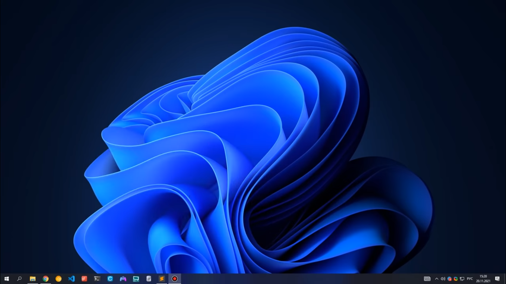

# Windows 10 робимо інтерфейс як у Windows 11 та покращюємо
Вітаю вас, хто читає цю статью. В ці статьї ви дізнайтеся Як на Windows 10 зробити інтерфейс як у Windows 11 та Як його покращити.
## Зміст
[Робимо інтерфейс Windows 10 як на Windows 11](https://github.com/Bratslavskij/win10-in-win11-i-pokrashenja#%D1%80%D0%BE%D0%B1%D0%B8%D0%BC%D0%BE-%D1%96%D0%BD%D1%82%D0%B5%D1%80%D1%84%D0%B5%D0%B9%D1%81-windows-10-%D1%8F%D0%BA-%D0%BD%D0%B0-windows-11)

[— Встановлюємо тему](https://github.com/Bratslavskij/win10-in-win11-i-pokrashenja#%D0%B2%D1%81%D1%82%D0%B0%D0%BD%D0%BE%D0%B2%D0%BB%D1%8E%D1%94%D0%BC%D0%BE-%D1%82%D0%B5%D0%BC%D1%83)
## Робимо інтерфейс Windows 10 як на Windows 11
### OldNewExplorer
OldNewExplorer — це програма яка приховує класичні елементи. Цю програму можна скачати [тут](https://github.com/Bratslavskij/win10-in-win11-i-pokrashenja/blob/main/OldNewExplorer.rar?raw=true), краще на Локальному Диску C створити папку Windows11Files і в цей каталог помістити архів. Потім видобуйте файли і відкрийте теку OldNewExplorer та запустіть файл OldNewExplorer.exe і поставте там галочки:

### Встановлюємо тему
Спочатку ми завантажимо архіви Windows 11 styles.rar, Windows 11 shell and wallpapers.rar, та виберіть один архів Windows 11 Dark NA.rar або Windows 11 Dark.rar або Windows 11 Light NA.rar або Windows 11 Light.rar. Потім відкрийте Файловий провідник Windows і перейдіть до цього каталогу:
```html
C:\Windows\Resources\Themes
```
Вставте в ций каталог архів своєї теми, та видобуйте файли своїм архіватором та видаліть архів. Потім сторімо папку Windows 11 в каталозі C:\Windows\Resources\Themes та зробіть це з архівами Windows 11 styles.rar та Windows 11 shell and wallpapers.rar як з архівом теми. Потім ідемо на верх каталога та двічі разів натисніть на Windows 11 тему та зачекайте. Після цього має бути такий результат чи щось інше:


